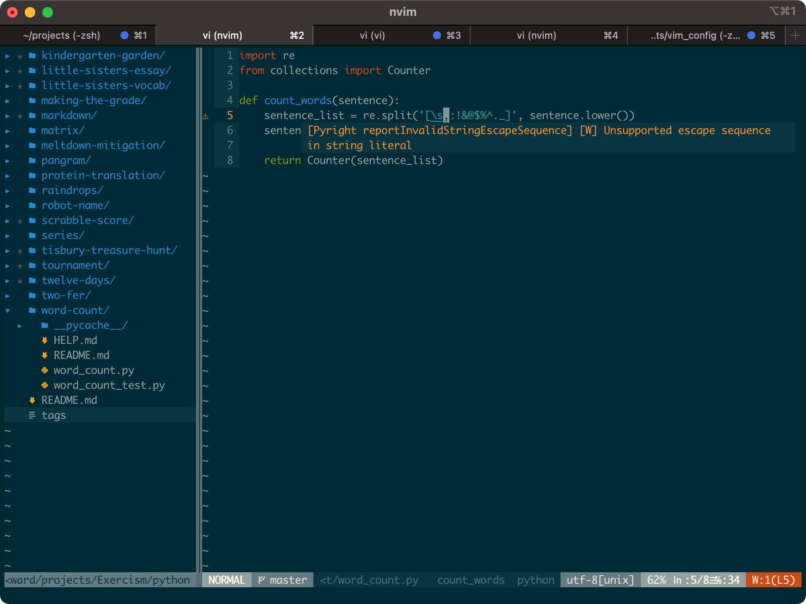

## vim_config

vim/neovim setup especially for ruby/python/elixir developers



[vim user goes here](vim/README.md)

[neovim user goes here](neovim/README.md)

# windows user on xshell

## Solarized_Dark.xcs

Solarized Dark.xcs is one color schemes for xshell which is a ssh software in windows. start xshell then click color schemes and import it

## Deja Vu Sans Mono.ttf
Deja Vu Sans Mono.ttf is a windows font, just double click when you are on windows

# Mac user with Iterms

## Change Iterms Color Presets to **Solarized Dark**
**Preferences -> Profiles -> Colors -> Color Presets -> Solarized Dark/Light**

## vim-devicons
```
brew tap homebrew/cask-fonts
brew install font-hack-nerd-font --cask
```

Open Iterm2, Preferences => Profiles => Text => Non-ASCII Font => Hack Nerd Font
