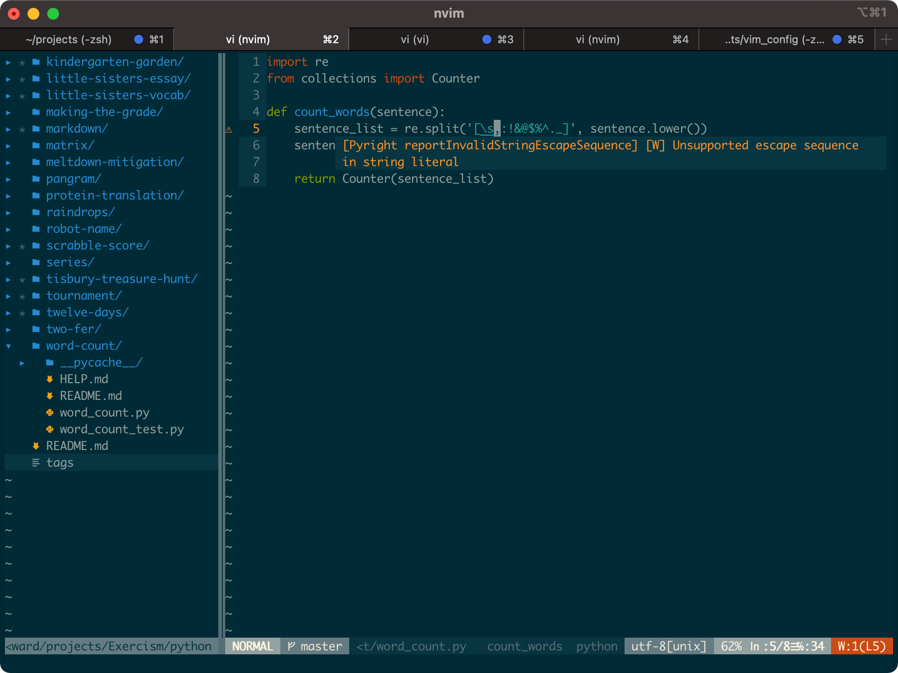

# Vim/Neovim Configuration

A comprehensive Vim and Neovim setup optimized for **Ruby**, **Python**, and **Elixir** developers. This configuration provides a modern, efficient development environment with beautiful syntax highlighting, powerful plugins, and cross-platform terminal support.



## 🚀 Features

- **Multi-language Support**: Optimized for Ruby, Python, and Elixir development
- **Beautiful Themes**: Solarized color scheme with multiple variants
- **Cross-platform**: Works on macOS, Windows, and Linux
- **Modern Plugins**: Includes fzf, ripgrep, ctags, and language servers
- **Terminal Integration**: Includes terminal color schemes and fonts
- **Easy Setup**: Simple installation process for both Vim and Neovim

## 📋 Prerequisites

- **Vim**: Version 8.0+ or **Neovim**: Version 0.5+
- **Git**: For cloning the repository
- **Package Manager**: Homebrew (macOS) or equivalent for your OS
- **Terminal**: iTerm2 (macOS), XShell (Windows), or compatible terminal

## 🛠️ Quick Start

Choose your editor:

- **[Vim Setup Guide](vim/README.md)** - For Vim users
- **[Neovim Setup Guide](neovim/README.md)** - For Neovim users

## 🖥️ Terminal Configuration

### macOS with iTerm2

1. **Install Color Scheme**:
   - Open iTerm2 Preferences
   - Go to **Profiles → Colors → Color Presets**
   - Select **Solarized Dark** or **Solarized Light**

2. **Install Nerd Fonts** (for icons):
   ```bash
   brew tap homebrew/cask-fonts
   brew install font-hack-nerd-font --cask
   ```
   - In iTerm2: **Preferences → Profiles → Text → Non-ASCII Font**
   - Select **Hack Nerd Font**

### Windows with XShell

1. **Install Color Scheme**:
   - Download `Solarized_Dark.xcs` from this repository
   - Open XShell
   - Go to **Tools → Color Schemes → Import**
   - Select the `Solarized_Dark.xcs` file

2. **Install Font**:
   - Download `Deja_Vu_Sans_Mono.ttf` from this repository
   - Double-click the font file to install it
   - Configure XShell to use the font in your session settings

## 📁 Project Structure

```
vim_config/
├── vim/                    # Vim configuration
│   ├── .vimrc             # Main Vim config file
│   ├── solarized.vim      # Solarized color scheme
│   └── README.md          # Vim setup instructions
├── neovim/                # Neovim configuration
│   ├── init.vim           # Main Neovim config file
│   ├── init.lua           # Lua configuration
│   ├── colors/            # Color schemes
│   └── README.md          # Neovim setup instructions
├── Solarized_Dark.xcs     # XShell color scheme
├── Deja_Vu_Sans_Mono.ttf  # Windows font
└── screenshots/           # Screenshots
```

## 🔧 Included Tools

- **fzf**: Fuzzy file finder
- **ripgrep**: Fast text search
- **ctags**: Code navigation
- **Language Servers**: For Python and Elixir
- **Solarized Themes**: Multiple color scheme variants

## 📖 Documentation

- [Vim Configuration Guide](vim/README.md)
- [Neovim Configuration Guide](neovim/README.md)

## 🤝 Contributing

Feel free to submit issues and enhancement requests!

## 📄 License

This project is open source and available under the [MIT License](LICENSE).
